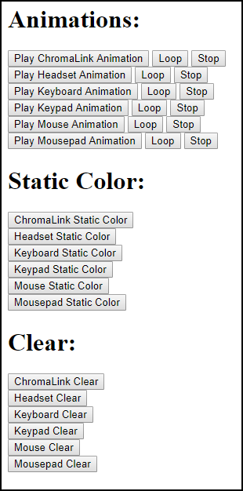
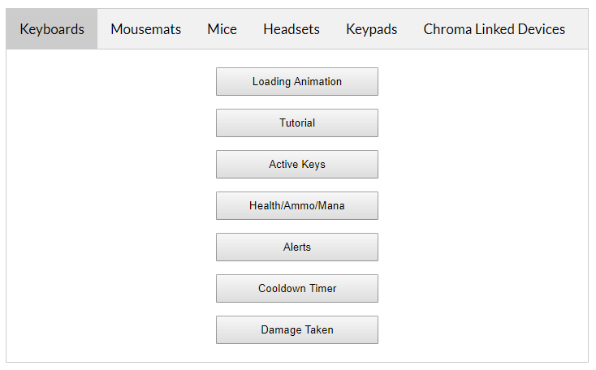

# HTML5ChromaSDK - JS Library for playing Chroma animations

- [REST Sample App](http://developer.razerzone.com/works-with-chroma/download/) - This repository expands from the sample app to include support for `Chroma` animation playback.

**Table of Contents**

* [Related](#related)
* [Frameworks supported](#frameworks-supported)
* [Prerequisites](#prerequisites)
* [Assets](#assets)
* [API](#api)

<a name="related"></a>
## Related

- [CChromaEditor](https://github.com/RazerOfficial/CChromaEditor) - C++ Native MFC Library for playing and editing Chroma animations

- [GameMakerChromaExtension](https://github.com/RazerOfficial/GameMakerChromaExtension) - GameMaker Extension to control lighting for Razer Chroma

- [UE4ChromaSDK](https://github.com/RazerOfficial/UE4ChromaSDK) - Unreal Engine 4 (UE4) Blueprint library to control lighting for Razer Chroma

- [UnityNativeChromaSDK](https://github.com/RazerOfficial/UnityNativeChromaSDK) - Unity native library for the ChromaSDK

- [UnityChromaSDK](https://github.com/RazerOfficial/UnityChromaSDK) - Unity C# library for the Chroma Rest API

<a name="frameworks-supported"></a>
## Frameworks supported

- Windows ChromaSDK (32-bit)

- Windows ChromaSDK (64-bit)

<a name="prerequisites"></a>
## Prerequisites

- Install [Synapse](http://developer.razerzone.com/works-with-chroma/download/)

- Install [Chroma SDK 2.5.3](http://developer.razerzone.com/works-with-chroma/download/)

- (Optional) [Node.js](https://nodejs.org/en/) - Use to host the sample locally

<a name="getting-started"></a>
## Getting Started

**Node.JS** (Optional) The sample project can be hosted in `Node.js`

1 Install `Node.js`

2 Open a terminal in the project folder

3 Install `Node.js` dependencies

```
npm install
```

4 Start the server

```
node ServerNode.js
```

5 Browse the `Node.js` server and pick one of the samples at [http://localhost:1337/](http://localhost:1337/)

**Hosted**

1 Upload the project files to an online website

2 Browse `PlayAnimationSample.html`



3 Browse `RazerChromaSDKSampleApplication.html`



<a name="assets"></a>
## Assets

This library supports the `Chroma` animation exports from [UE4](https://github.com/RazerOfficial/UE4ChromaSDK), [Unity](https://github.com/RazerOfficial/UnityNativeChromaSDK/), and [GameMaker](https://github.com/RazerOfficial/GameMakerChromaExtension).

**Import Animation From Unity**

<a target="_blank" href="https://www.youtube.com/watch?v=4-NjkEHckkM"></a>

* The same `Chroma` animation files can be played on HTTP and HTTPS websites.

<a name="api"></a>
## API

**Initialization**

Include the `JS` includes to get access to the `API`.

```js
<html>
<head>
<script src="ChromaSDKImpl.js"></script>
</head>
</html>
```

Initialize/Uninitialize the `Chroma` SDK from the body events.

```js
<script>
var chromaSDK = undefined;
function onPageLoad() {
  chromaSDK = new ChromaSDK();
  chromaSDK.init();
}
function onPageUnload() {
  if (chromaSDK != undefined) {
    chromaSDK.uninit()
  }
}
</script>
<body onload="onPageLoad()" onunload="onPageUnload()">
```

**Clear**

The `clear` method will turn off the lighting effect for a device.

```js
ChromaAnimation.clear(EChromaSDKDeviceEnum.DE_ChromaLink);
ChromaAnimation.clear(EChromaSDKDeviceEnum.DE_Headset);
ChromaAnimation.clear(EChromaSDKDeviceEnum.DE_Keyboard);
ChromaAnimation.clear(EChromaSDKDeviceEnum.DE_Keypad);
ChromaAnimation.clear(EChromaSDKDeviceEnum.DE_Mouse);
ChromaAnimation.clear(EChromaSDKDeviceEnum.DE_Mousepad);
```

**Static Color**

The `staticColor` method will set the `Chroma` lighting to all the same color for the device, given a color.

```js
var red = 0xFF;
var green = 0xFF00
var blue = 0xFF0000;
var white = 0xFFFFFF;
var color = white;
ChromaAnimation.staticColor(EChromaSDKDeviceEnum.DE_ChromaLink, color);
ChromaAnimation.staticColor(EChromaSDKDeviceEnum.DE_Headset, color);
ChromaAnimation.staticColor(EChromaSDKDeviceEnum.DE_Keyboard, color);
ChromaAnimation.staticColor(EChromaSDKDeviceEnum.DE_Keypad, color);
ChromaAnimation.staticColor(EChromaSDKDeviceEnum.DE_Mouse, color);
ChromaAnimation.staticColor(EChromaSDKDeviceEnum.DE_Mousepad, color);
```

**Play Animation**

The `playAnimation` method will play a `Chroma` animation file. With `loop` set to `true`, the animation will repeat. With `loop` set to `false`, the animation will play once.

```js
var loop = true;
ChromaAnimation.playAnimation('Random_ChromaLink.chroma', loop);
ChromaAnimation.playAnimation('Random_Headset.chroma', loop);
ChromaAnimation.playAnimation('Random_Keyboard.chroma', loop);
ChromaAnimation.playAnimation('Random_Keypad.chroma', loop);
ChromaAnimation.playAnimation('Random_Mouse.chroma', loop);
ChromaAnimation.playAnimation('Random_Mousepad.chroma', loop);
```

**Stop Animation**

The `stopAnimation` method will stop playing a `Chroma` animation file.

```js
ChromaAnimation.stopAnimation('Random_ChromaLink.chroma');
ChromaAnimation.stopAnimation('Random_Headset.chroma');
ChromaAnimation.stopAnimation('Random_Keyboard.chroma');
ChromaAnimation.stopAnimation('Random_Keypad.chroma');
ChromaAnimation.stopAnimation('Random_Mouse.chroma');
ChromaAnimation.stopAnimation('Random_Mousepad.chroma');
```

**Play Composite**

The `playComposite` method will play a set of `Chroma` animation files. With `loop` set to `true`, the animations will repeat. With `loop` set to `false`, the animations will play once.

```js
var loop = true;
ChromaAnimation.playComposite('Random', loop);

// playComposite will play the set of animations
//ChromaAnimation.playAnimation('Random_ChromaLink.chroma', loop);
//ChromaAnimation.playAnimation('Random_Headset.chroma', loop);
//ChromaAnimation.playAnimation('Random_Keyboard.chroma', loop);
//ChromaAnimation.playAnimation('Random_Keypad.chroma', loop);
//ChromaAnimation.playAnimation('Random_Mouse.chroma', loop);
//ChromaAnimation.playAnimation('Random_Mousepad.chroma', loop);
```
