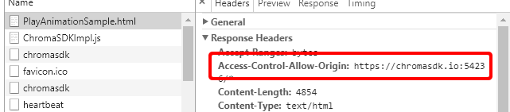
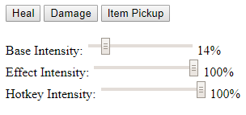

# HTML5ChromaSDK - JS Library for playing Chroma animations

- [REST Sample App](http://developer.razerzone.com/works-with-chroma/download/) - This repository expands from the sample app to include support for `Chroma` animation playback.

**Table of Contents**

* [See also](#see-also)
* [Prerequisites](#prerequisites)
* [Quick Start](#quick-start)
* [Assets](#assets)
* [API](#api)

<a name="related"></a>
## See Also

**Docs:**

- [Chroma Animation Guide](http://chroma.razer.com/ChromaGuide/) - Visual examples of the Chroma Animation API methods

**Plugins:**

- [CChromaEditor](https://github.com/RazerOfficial/CChromaEditor) - C++ Native MFC Library for playing and editing Chroma animations

- [GameMakerChromaExtension](https://github.com/RazerOfficial/GameMakerChromaExtension) - GameMaker Extension to control lighting for Razer Chroma

- [HTML5ChromaSDK](https://github.com/RazerOfficial/HTML5ChromaSDK) - JS Library for playing Chroma animations

- [UE4_XDK_SampleApp](https://github.com/razerofficial/UE4_XDK_SampleApp) - UE4 Chroma samples and runtime module with Blueprint library for the ChromaSDK

- [UnityNativeChromaSDK](https://github.com/RazerOfficial/UnityNativeChromaSDK) - Unity native library for the ChromaSDK

<a name="prerequisites"></a>
## Prerequisites

- Install [Synapse](https://www.razer.com/synapse-3) with the Chroma Connect Module and sign-in or use guest

- (Optional) [Node.js](https://nodejs.org/en/) - Use to host the sample locally

<a name="quick-start"></a>
## Quick Start

* [Template.html](Template.html) [Template.js](Template.js)


<a name="getting-started"></a>
## Getting Started

**Browser Security**

In order to allow an HTML5 page to talk with the Chroma REST API (cross-site scripting), add the response header for `Access-Control-Allow-Origin`.

<pre>
Access-Control-Allow-Origin: https://chromasdk.io:54236/*
</pre>




**Node.JS** (Optional) The sample project can be hosted in `Node.js`

1 Install `Node.js`

2 Open a terminal in the project folder

3 Install `Node.js` dependencies

```
npm install
```

4 Start the server

```
node ServerNode.js
```

5 Browse the `Node.js` server and pick one of the samples at [http://localhost:1337/](http://localhost:1337/)

**Hosted**

1 Upload the project files to an online website

2 Browse `PlayAnimationSample.html`


3 Browse `RazerChromaSDKSampleApplication.html`


4 Browse 'LayerSample.html'



<a name="assets"></a>
## Assets

This library supports the `Chroma` animation exports from [UE4](https://github.com/RazerOfficial/UE4ChromaSDK), [Unity](https://github.com/RazerOfficial/UnityNativeChromaSDK/), and [GameMaker](https://github.com/RazerOfficial/GameMakerChromaExtension).

**Import Animation From Unity**

<a target="_blank" href="https://www.youtube.com/watch?v=4-NjkEHckkM"></a>

* The same `Chroma` animation files can be played on HTTP and HTTPS websites.

<a name="api"></a>
## API

---

**Initialization**

Include the `JS` includes to get access to the `API`.

```js
<html>
<head>
<script src="ChromaSDKImpl.js"></script>
</head>
</html>
```

Initialize/Uninitialize the `Chroma` SDK from the body events.

```js
<script>
var chromaSDK = undefined;
function onPageLoad() {
  chromaSDK = new ChromaSDK();
  chromaSDK.init();
}
function onPageUnload() {
  if (chromaSDK != undefined) {
    chromaSDK.uninit()
  }
}
</script>
<body onload="onPageLoad()" onunload="onPageUnload()">
```

---

**Clear**

The `clear` method will turn off the lighting effect for a device.

```js
ChromaAnimation.clear(EChromaSDKDeviceEnum.DE_ChromaLink);
ChromaAnimation.clear(EChromaSDKDeviceEnum.DE_Headset);
ChromaAnimation.clear(EChromaSDKDeviceEnum.DE_Keyboard);
ChromaAnimation.clear(EChromaSDKDeviceEnum.DE_Keypad);
ChromaAnimation.clear(EChromaSDKDeviceEnum.DE_Mouse);
ChromaAnimation.clear(EChromaSDKDeviceEnum.DE_Mousepad);
```

---

**Clear All**

The `clearAll` method sets the clear state for all devices.

```js
ChromaAnimation.clearAll();
```

---

**Static Color**

The `staticColor` method will set the `Chroma` lighting to all the same color for the device, given a color.

```js
var red = 0xFF;
var green = 0xFF00
var blue = 0xFF0000;
var white = 0xFFFFFF;
var color = white;
ChromaAnimation.staticColor(EChromaSDKDeviceEnum.DE_ChromaLink, color);
ChromaAnimation.staticColor(EChromaSDKDeviceEnum.DE_Headset, color);
ChromaAnimation.staticColor(EChromaSDKDeviceEnum.DE_Keyboard, color);
ChromaAnimation.staticColor(EChromaSDKDeviceEnum.DE_Keypad, color);
ChromaAnimation.staticColor(EChromaSDKDeviceEnum.DE_Mouse, color);
ChromaAnimation.staticColor(EChromaSDKDeviceEnum.DE_Mousepad, color);
```

---

**Play Animation**

The `playAnimation` method will play a `Chroma` animation file. With `loop` set to `true`, the animation will repeat. With `loop` set to `false`, the animation will play once.

```js
var loop = true;
ChromaAnimation.playAnimation('Random_ChromaLink.chroma', loop);
ChromaAnimation.playAnimation('Random_Headset.chroma', loop);
ChromaAnimation.playAnimation('Random_Keyboard.chroma', loop);
ChromaAnimation.playAnimation('Random_Keypad.chroma', loop);
ChromaAnimation.playAnimation('Random_Mouse.chroma', loop);
ChromaAnimation.playAnimation('Random_Mousepad.chroma', loop);
```

---

**Stop Animation**

The `stopAnimation` method will stop playing a `Chroma` animation file.

```js
ChromaAnimation.stopAnimation('Random_ChromaLink.chroma');
ChromaAnimation.stopAnimation('Random_Headset.chroma');
ChromaAnimation.stopAnimation('Random_Keyboard.chroma');
ChromaAnimation.stopAnimation('Random_Keypad.chroma');
ChromaAnimation.stopAnimation('Random_Mouse.chroma');
ChromaAnimation.stopAnimation('Random_Mousepad.chroma');
```

---

**Stop All**

The `stopAll` method stops all animations from playing for all devices.

```js
ChromaAnimation.stopAll();
```

---

**Play Composite**

The `playComposite` method will play a set of `Chroma` animation files. With `loop` set to `true`, the animations will repeat. With `loop` set to `false`, the animations will play once.

```js
var loop = true;
ChromaAnimation.playComposite('Random', loop);

// playComposite will play the set of animations
//ChromaAnimation.playAnimation('Random_ChromaLink.chroma', loop);
//ChromaAnimation.playAnimation('Random_Headset.chroma', loop);
//ChromaAnimation.playAnimation('Random_Keyboard.chroma', loop);
//ChromaAnimation.playAnimation('Random_Keypad.chroma', loop);
//ChromaAnimation.playAnimation('Random_Mouse.chroma', loop);
//ChromaAnimation.playAnimation('Random_Mousepad.chroma', loop);
```

---

**Open Animation**

The `openAnimation` method downloads a `Chroma` animation and invokes a callback after the animation has loaded.

```js
var baseLayer = "EnvironmentSnow_Keyboard.chroma";

// open animation
ChromaAnimation.openAnimation(baseLayer, function(baseAnimation) {
});
```

---

**Close Animation**

The `closeAnimation` method stops an animation if playing and then removes the animation so that it can be reloaded. This allows an animation to go back to the original state before any modifications had taken place.

```js
var baseLayer = "EnvironmentSnow_Keyboard.chroma";

//reset animation
ChromaAnimation.closeAnimation(baseLayer);

//open animation
ChromaAnimation.openAnimation(baseLayer, function(baseAnimation) {
  });
```

---

**Multiply Intensity All Frames**

The `multiplyIntensityAllFrames` method multiplies a color intensity for all frames of an animation. This is useful to control the intensity of a layer. `0.0` results in a completely black layer. `0.5` would half the color values for all frames.

```js
var baseLayer = "EnvironmentSnow_Keyboard.chroma";

// reset animation
ChromaAnimation.closeAnimation(baseLayer);

// open animation
ChromaAnimation.openAnimation(baseLayer, function(baseAnimation) {

  // set base intensity
  ChromaAnimation.multiplyIntensityAllFrames(baseLayer, (baseIntensity.value / 100.0));

});
```

---

**Offset Nonzero Colors All Frames**

The `offsetNonZeroColorsAllFrames` method offsets the RGB values for all frames in the animation that aren't black. This method allows a gray animation layer to be tinted to any color while keeping the black colors black. Red, green, blue use expected values `0` to `255`.

```js
var layer2 = "RingGray_Keyboard.chroma";

// reset animation
ChromaAnimation.closeAnimation(layer2);

// open animation
ChromaAnimation.openAnimation(layer2, function(layer2Animation) {

  // set base intensity
  ChromaAnimation.multiplyIntensityAllFrames(layer2,
    (effectIntensity.value / 100.0));

  //animation starts with 127,127,127 so adding 127,-127,-127 results in 255,0,0 or red
  ChromaAnimation.offsetNonZeroColorsAllFrames(layer2, 127, -127, -127);

});
```

---

**Copy NonZero All Keys All Frames**

The `copyNonZeroAllKeysAllFrames` method copies all non-black colors for all frames from a source animation to a target animation. This is useful for combining multiple layers into a base layer.

```js
ChromaAnimation.copyNonZeroAllKeysAllFrames(sourceAnimationName, targetAnimationName);
```

---

**Copy Keys Colors All Frames**

The `copyKeysColorAllFrames` method copies all specified keys from one source animation to a target animation.

```js
// set wasd keys
var keys = [];
keys.push(RZKEY.RZKEY_W);
keys.push(RZKEY.RZKEY_A);
keys.push(RZKEY.RZKEY_S);
keys.push(RZKEY.RZKEY_D);

ChromaAnimation.copyKeysColorAllFrames(sourceAnimationName, targetAnimationName, keys);
```

---
